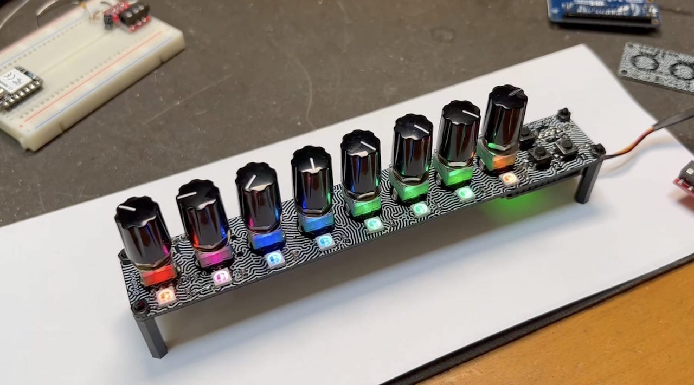
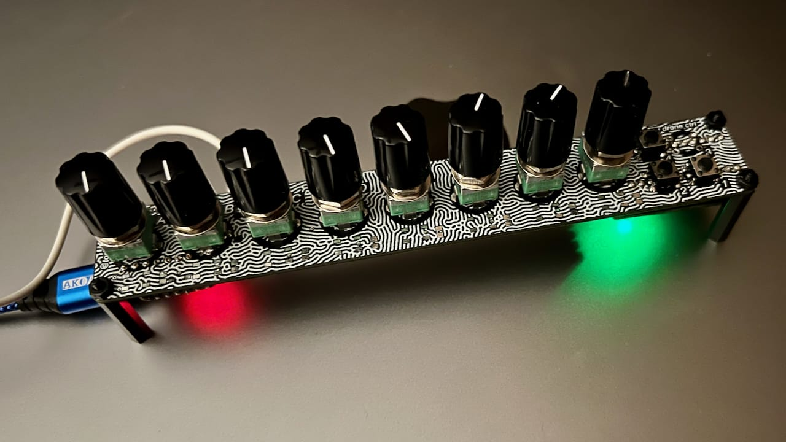

# seeknobs

knob board for seesaw, and also a drone synth

seeknobs PCB features:

- 8 knobs, read by seesaw
- 4 buttons, read by seesaw
- 8 NeoPixels, driven by seesaw
- 1 TRS 3.5mm (1/8") output as either audio or MIDI, driven by QTPy
- socket for optional QTPy M0 or RP2040 

